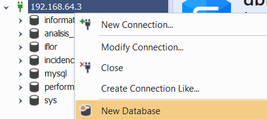
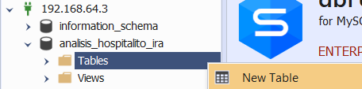

# Configuració del servidor MySQL

## Administració remota

### Configuració del servidor

El nostre servidor MySQL l'administració remota, amb el nostre client. Per permetre l'administració remota amb interficie grafica tenim que configurar l'arxiu /etc/mysql/mysql.conf.d/mysqld.cnf editant els següents parametres:

```:
# Instead of skip-networking the default is now to listen only on
# localhost which is more compatible and is not less secure.
bind-address            = 0.0.0.0
mysqlx-bind-address     = 127.0.0.1
```

Aixi fem que el servidor permeti qualsevol IP accedeixi a les base de dades MySQL.

### Configuració del client

Ara en el client accedirem a descarregar [dbForge](https://www.devart.com/login.html?requestedUrl=/dbforge/mysql/studio/download.html&getTrial=true) per poder administrar el nostre servidor.

## Creació de la Base de Dades i Taules

Ara crearem la base de dades i les taules per poder emmagatzemar les dades dels analisis.

### Creació de la BD

Per crear la base de dades executarem les següents comandes, per primera accedirem al terminal de Mysql, amb:

```:
sudo mysql 
```

Ara amb la terminal oberta crearem un usuari per poder administrar-ho per remot. Per aixo farem l'usuari adminmysql.

```:
CREATE USER 'adminmysql'@'%' IDENTIFIED BY 'P@ssw0rd'; 
GRANT ALL PRIVILEGES ON *.* TO 'adminmysql'@'%' WITH GRANT OPTION;
FLUSH PRIVILEGES;
```

Amb l'usuari creat farem la base de dades. Per fer-la anirem al dbforge i connectarem amb la IP del servidor i l'usuri creat amb anterioritat i crearem la BD amb click dret i "New DataBase".


Ara si vols fer-ho amb comandes, la nostra Base de dades l'hem fet amb el codi següent:

```:
CREATE DATABASE analisis_hospitalito_ira
CHARACTER SET utf8mb4
COLLATE utf8mb4_0900_ai_ci;
```

### Creació de les taules

Per seguir amb la creació anirem a les taules, per crear-les podem fer-ho amb dbForge amb el mateix procediment, doble-click la base de dades, click dret a Tables i finalment a New Table.


Ara per comandes hem fet aquest codi SQL: [Click-me](<../../Codi SQL/CreateTables.sql>), fem aquest codi en un arxiu ja que es molt llarg.

### Dummy Data

Finalment per inserir dades fem un arxiu amb dades inventades per poder probar la base de dades. [Click-me](<../../Codi SQL/InsertDummy.sql>)
